# Homebase

Homebase is a self-hosted household operations application for projects, tasks, schedules, records, and shared household information. It uses a Go API, a separate server-rendered Go web frontend, PostgreSQL, OAuth/OIDC authentication, and Docker deployment.

## Contents

- [Features](#features)
- [Screenshots](#screenshots)
  - [Dashboard](#dashboard)
  - [Projects](#projects)
  - [Tasks](#tasks)
  - [Calendar](#calendar)
  - [Routines](#routines)
  - [Lists](#lists)
  - [Contacts](#contacts)
  - [Assets](#assets)
  - [Documents](#documents)
  - [Users](#users)
  - [Settings and API tokens](#settings-and-api-tokens)
  - [API documentation](#api-documentation)
- [Responsive Design](#responsive-design)
- [Architecture](#architecture)
- [Run Locally](#run-locally)
- [Production Deployment](#production-deployment)
- [OAuth/OIDC](#oauthoidc)
- [API and Tokens](#api-and-tokens)
- [Configuration](#configuration)
- [Development Notes](#development-notes)

## Features

### Work and scheduling

- Projects with folders, due dates, priorities, status, and nested project tasks
- Standalone tasks and project tasks with assignees, due dates, priorities, and status
- Task and project dashboard statistics for past-due, due-today, and upcoming work
- Appointments plus day, week, and month calendar views
- Recurring routines that automatically generate tasks
- Asset maintenance schedules, each with its own recurrence and generated task history

### Household records

- Household members with owner/member roles
- Contacts with reusable links to projects, tasks, and assets
- Assets with serial number, model, vendor, purchase date, cost, warranty, maintenance, contacts, and documents
- Uploaded documents with search, type filtering, PDF/image preview, download, and reusable related-item links
- Shared lists with assignable, dated, completable items

### Interface

- Customizable dashboard with movable and removable modules
- Dashboard calendar, task/project statistics, appointments, and selectable household list
- Universal search across tasks, projects, documents, and other records
- Collapsible desktop navigation and mobile navigation drawer
- Responsive card layouts for project and task workflows
- Dark and light themes
- In-app routine notifications

### Integration and security

- Generic OAuth 2.0/OpenID Connect authentication
- Household-scoped browser sessions
- Pre-provisioned user access: OAuth users must already belong to a household
- Read-only and full-access bearer API tokens
- OpenAPI 3.0 contract and public Swagger UI
- Optional external budget application link

## Screenshots

### Dashboard

The dashboard combines the calendar, project/task due-date statistics, appointments, and a selectable household list. Modules can be moved or removed.

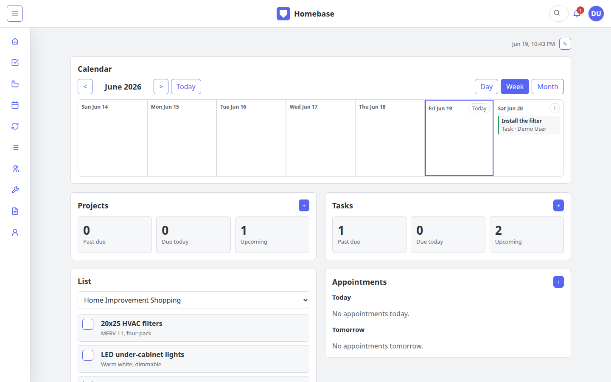

### Projects

Projects support status, priority, due dates, folders, task counts, attached documents, contacts, and assets.

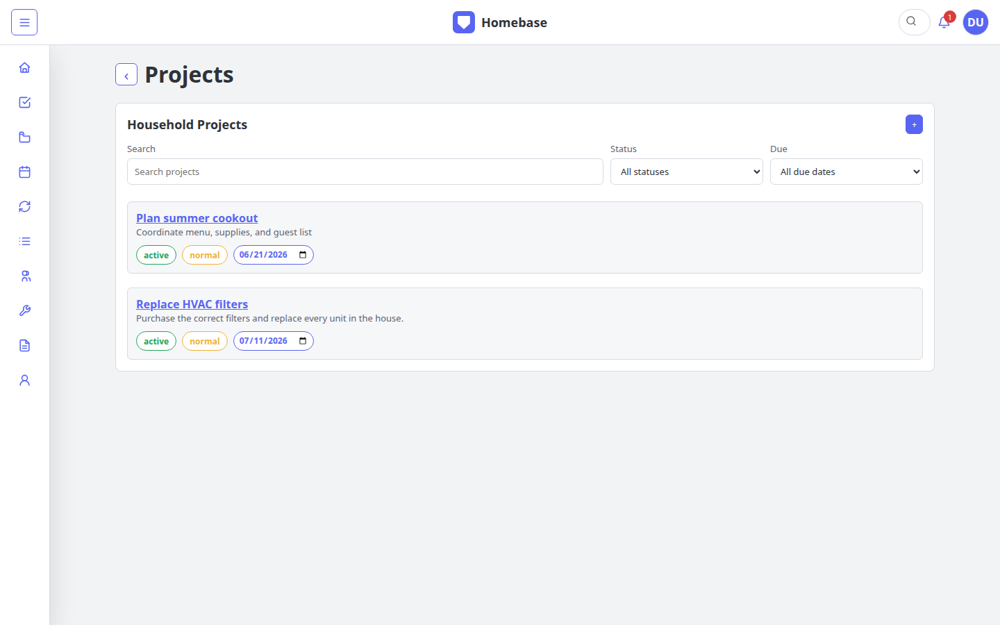

An open project groups tasks into collapsible folders while keeping assignment,
due date, status, priority, actions, and related household records visible.

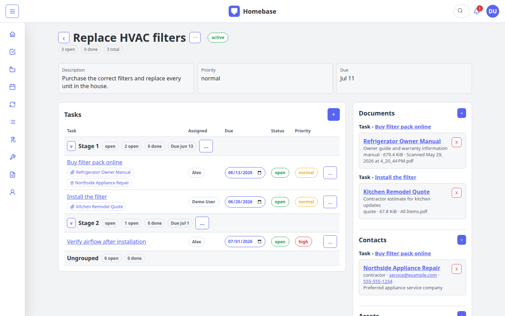

### Tasks

The household task index combines standalone, project, routine, and maintenance-generated tasks with search and due-date filters.

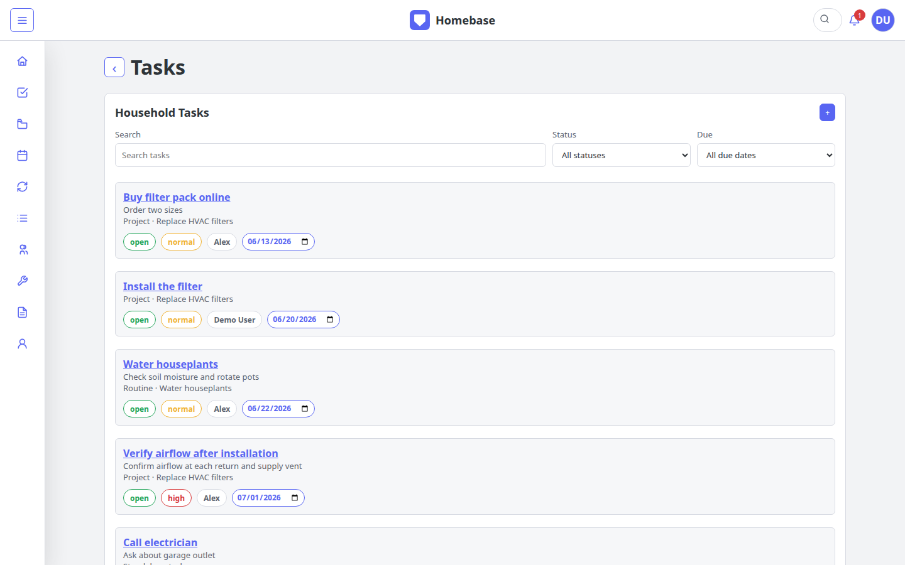

### Calendar

The calendar combines appointments, tasks, project deadlines, and routine due dates in day, week, and month views.

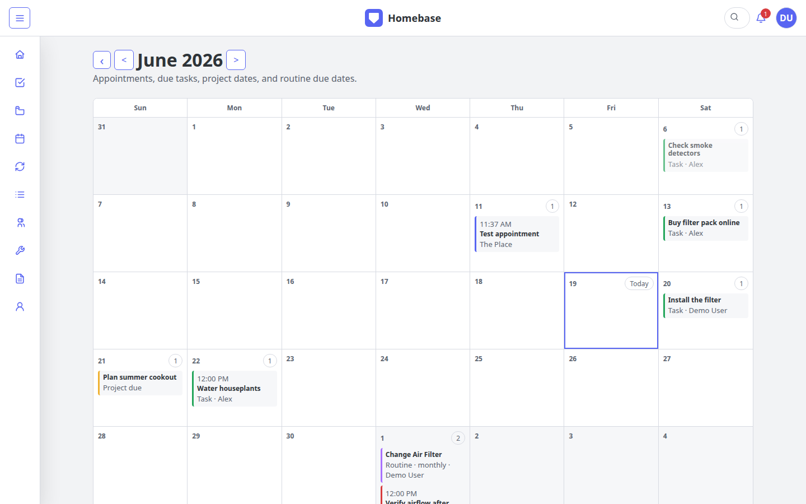

### Routines

Routines track cadence, assignment, and next due date, and automatically generate tasks when due.

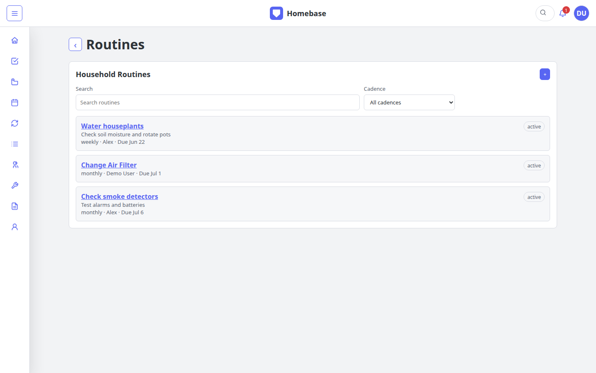

### Lists

Lists support assignees, notes, due dates, completion, and use directly from the dashboard.

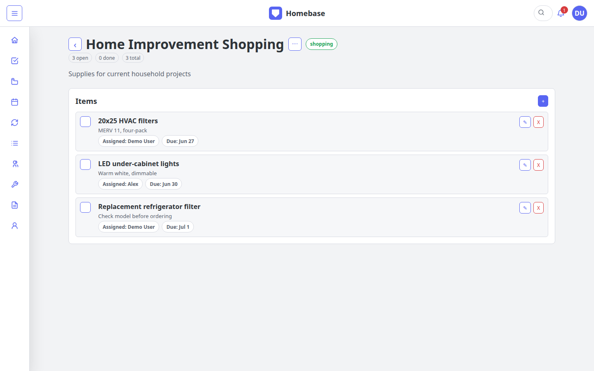

### Contacts

Contacts are reusable household records that can be attached to projects, tasks, and assets.

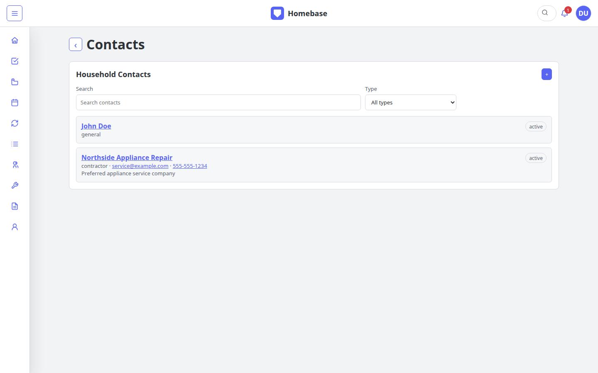

### Assets

Assets track purchase and warranty details, multiple maintenance schedules, generated tasks, documents, and service contacts.

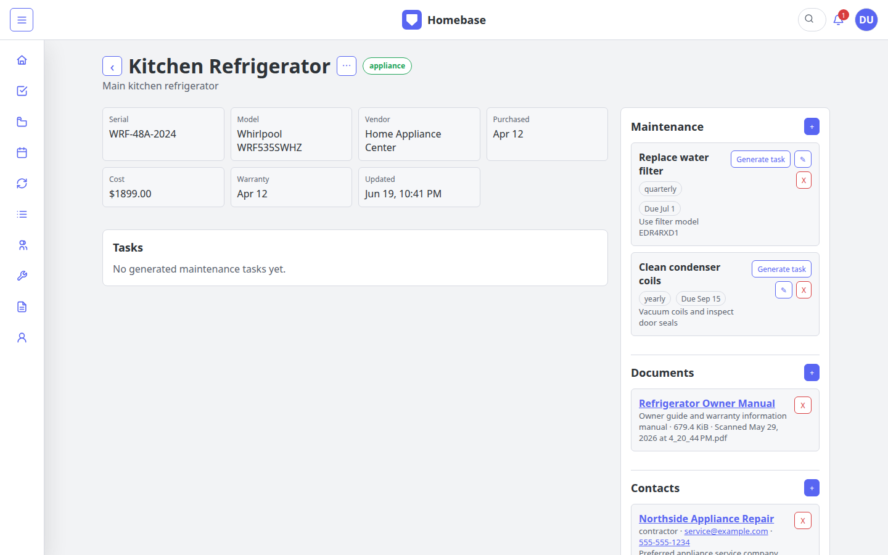

### Documents

Documents support upload, search, type filtering, download, PDF/image preview, and links to projects, tasks, and assets.

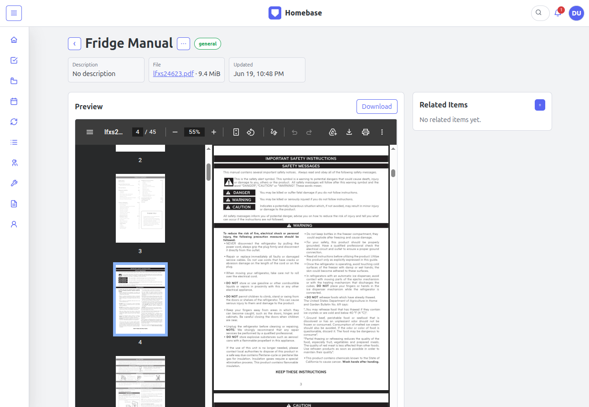

### Users

Household owners can pre-provision OAuth users and manage owner/member roles.

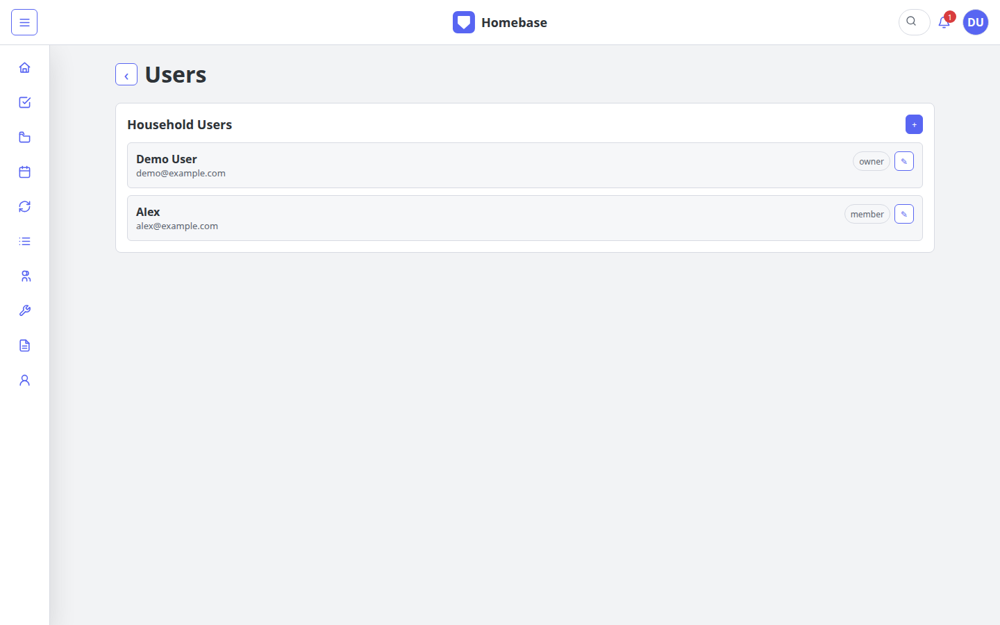

### Settings and API tokens

Users can create and revoke read-only or full-access API tokens. Plaintext token values are displayed only at creation.

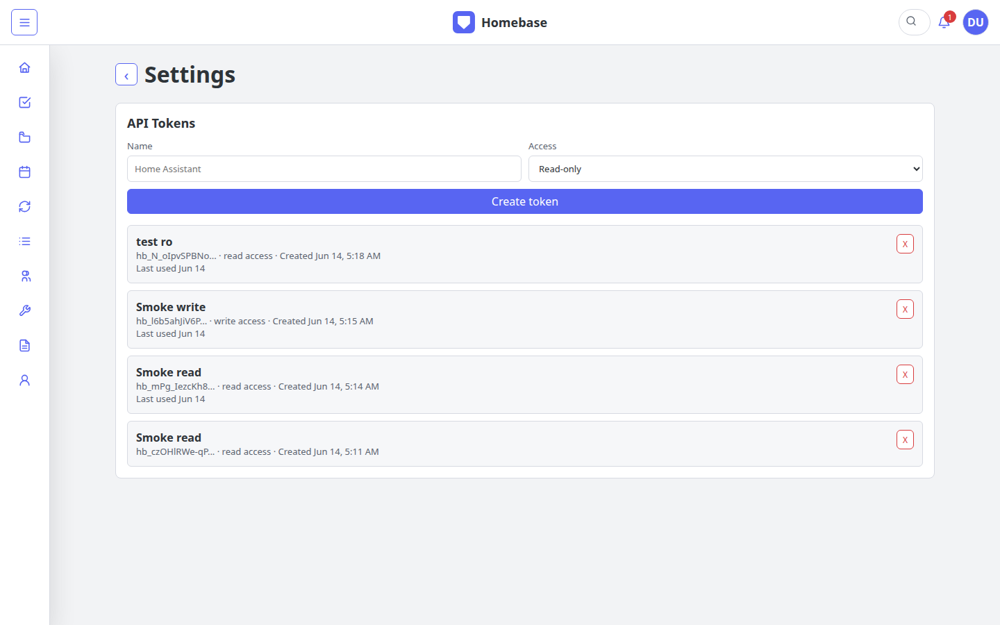

### API documentation

Swagger UI documents session and bearer-token authentication as well as the household API.

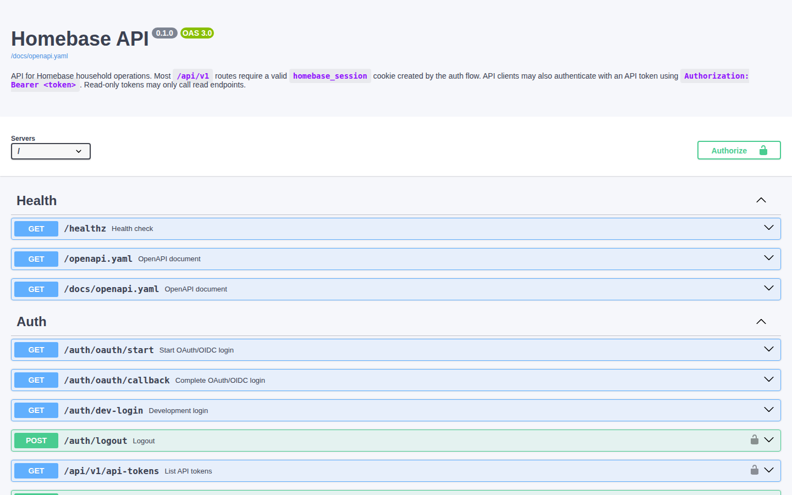

## Responsive Design

Homebase includes responsive layouts across its primary modules so the web
application remains usable on phones and tablets:

- The desktop sidebar becomes a slide-out navigation drawer.
- Project folders and task tables become stacked cards.
- Detail pages stack their main content and related-record panels.
- Status, priority, assignee, and due-date controls remain available from task
  and project cards.
- Forms and modals collapse to single-column layouts.
- Date fields use the device's native date picker, including the iOS picker.
- Calendar views switch to narrow-screen day-oriented layouts when the full
  grid is no longer practical.

Real-device responsive testing remains an ongoing part of development,
especially for drag-and-drop workflows and newly added controls. Current
follow-up items are tracked in [`TODO.md`](TODO.md).

## Architecture

Homebase is a modular monolith split into two deployable Go processes:

- `cmd/api`: authentication, business rules, background routine checks, file storage, and JSON API
- `cmd/web`: server-rendered UI and form forwarding
- `internal/store`: PostgreSQL persistence and embedded migrations
- `internal/api/openapi.yaml`: OpenAPI 3.0 contract
- `deploy/nginx/homebase.conf`: same-origin production reverse proxy

The API owns business rules. The web service renders pages and forwards mutations to the API. Household IDs are applied at the storage and API boundaries to isolate household data.

## Run Locally

Requirements:

- Docker Engine
- Docker Compose

Start the development stack:

```sh
cp .env.example .env
docker compose up --build
```

Open:

- Web application: http://localhost:8080
- API health: http://localhost:8081/healthz
- Swagger UI: http://localhost:8080/docs
- Raw OpenAPI document: http://localhost:8080/openapi.yaml

When OAuth is not configured, the development login creates a local demo session. Production mode does not permit this fallback.

## Production Deployment

The example production stack is [`docker-compose.dockerhub.example.yml`](docker-compose.dockerhub.example.yml). It uses published Docker Hub images and includes:

- nginx public entrypoint
- Homebase web service
- Homebase API service
- PostgreSQL
- persistent document-upload and database volumes

Copy the example environment file and set production values:

```sh
cp .env.example .env
```

At minimum, configure:

```sh
POSTGRES_PASSWORD=replace-with-a-long-random-value
SESSION_SECRET=replace-with-a-long-random-value
APP_TIMEZONE=America/Chicago
WEB_BASE_URL=https://homebase.example.com
API_BASE_URL=https://homebase.example.com

OAUTH_PROVIDER_NAME=Authentik
OAUTH_ISSUER_URL=https://auth.example.com/application/o/homebase/
OAUTH_CLIENT_ID=...
OAUTH_CLIENT_SECRET=...

BOOTSTRAP_OWNER_EMAIL=you@example.com
BOOTSTRAP_OWNER_NAME="Your Name"
BOOTSTRAP_HOUSEHOLD_NAME="Home"
```

Start the stack:

```sh
docker compose -f docker-compose.dockerhub.example.yml pull
docker compose -f docker-compose.dockerhub.example.yml up -d
```

The nginx service routes:

- `/` to the web service
- `/auth/` and `/api/v1/` to the API
- `/healthz` and OpenAPI paths to the API

Publish nginx behind the application hostname. Keeping browser pages, API calls, and the OAuth callback on one origin avoids cross-origin session and cookie configuration.

Persistent data lives in:

- `homebase_pgdata`: PostgreSQL database
- `homebase_uploads`: uploaded document files

Back up both volumes together.

## OAuth/OIDC

Homebase supports OIDC discovery through an issuer URL:

```sh
OAUTH_PROVIDER_NAME=Authentik
OAUTH_ISSUER_URL=https://auth.example.com/application/o/homebase/
OAUTH_CLIENT_ID=...
OAUTH_CLIENT_SECRET=...
OAUTH_SCOPES="openid profile email"
```

The default production callback is:

```text
https://homebase.example.com/auth/oauth/callback
```

Set `OAUTH_REDIRECT_URL` only when the callback must differ from `${API_BASE_URL}/auth/oauth/callback`.

Providers without discovery can use explicit endpoints:

```sh
OAUTH_AUTH_URL=https://auth.example.com/oauth/authorize
OAUTH_TOKEN_URL=https://auth.example.com/oauth/token
OAUTH_USERINFO_URL=https://auth.example.com/oauth/userinfo
```

The provider certificate must be trusted by the API container. The OAuth provider's token-signing certificate may be self-signed; OIDC token verification uses the provider's published JWKS. The HTTPS certificate used to reach the issuer and endpoints must chain to a trusted CA.

The first production owner is created from the `BOOTSTRAP_OWNER_*` variables. Additional users must be added from the Users screen before their OAuth login will succeed.

## API and Tokens

Signed-in users can create API tokens from **Profile > Settings**. Tokens inherit the user's household access and are shown only once.

- Read-only tokens can call `GET` and other read operations.
- Full-access tokens can also call supported write operations.
- Token management itself requires a browser session.

Example:

```sh
curl \
  -H "Authorization: Bearer hb_..." \
  https://homebase.example.com/api/v1/me
```

API references:

- Swagger UI: `/docs`
- Raw contract: `/openapi.yaml`
- Repository contract: [`internal/api/openapi.yaml`](internal/api/openapi.yaml)
- Additional notes: [`docs/api.md`](docs/api.md)

## Configuration

Important environment variables:

| Variable | Purpose |
| --- | --- |
| `WEB_BASE_URL` | Public browser origin |
| `API_BASE_URL` | Public API origin, normally the same as `WEB_BASE_URL` |
| `POSTGRES_PASSWORD` | PostgreSQL password used by the production compose stack |
| `SESSION_SECRET` | Session-signing secret |
| `SESSION_COOKIE_NAME` | Browser session cookie name |
| `APP_TIMEZONE` | IANA timezone used for calendar dates and "today", such as `America/Chicago` |
| `OAUTH_*` | OAuth/OIDC provider configuration |
| `BOOTSTRAP_OWNER_*` | Initial production household owner |
| `ROUTINE_CHECK_INTERVAL_SECONDS` | Routine scheduler interval; defaults to 900 seconds |
| `DOCUMENT_MAX_UPLOAD_MB` | Maximum uploaded document size; defaults to 25 MiB |
| `BUDGET_APP_URL` | Optional external budget application link |

See [`.env.example`](.env.example) for the complete list.

## Development Notes

- PostgreSQL is used in both development and production to avoid database behavior drift.
- Migrations run from the embedded schema when the API starts.
- Due routines are checked at API startup and then on the configured interval.
- Documents are reusable records. A single upload can be linked to multiple projects, tasks, and assets.
- Dashboard tile order and the selected dashboard list are retained per user/browser.
- Current follow-up work, including archive recovery and additional real-device QA, is tracked in [`TODO.md`](TODO.md).
